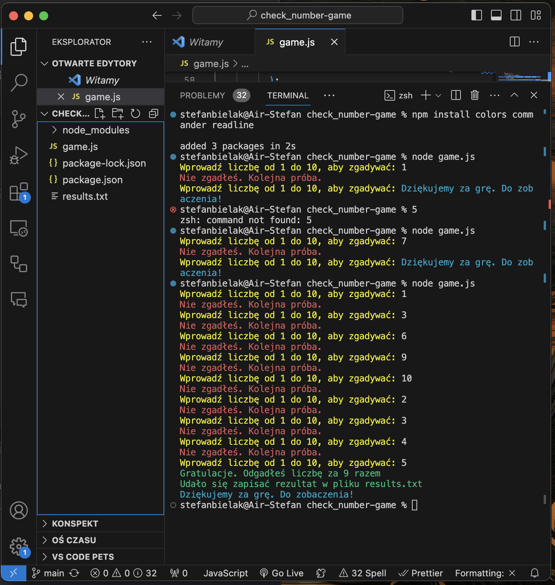

Witaj !
1. Nazwa : "Zgadnij liczbę"
2. Screenshot : 

3. Opis : 
Prosta gra w której twoim zadaniem jest zgadnięcie liczby od 1 do 10 . Sprawdź za którym razem Ci się uda i staraj się o jak najlepszy wynik. 
4. Instrukcja : 
- pobierz moje repozytorium,
- komenda : "node game.js" 
I mozesz się juz bawić :)